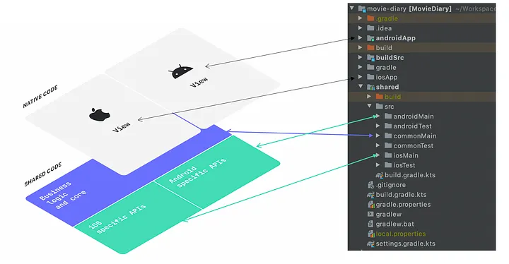
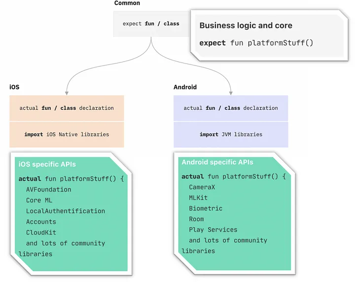
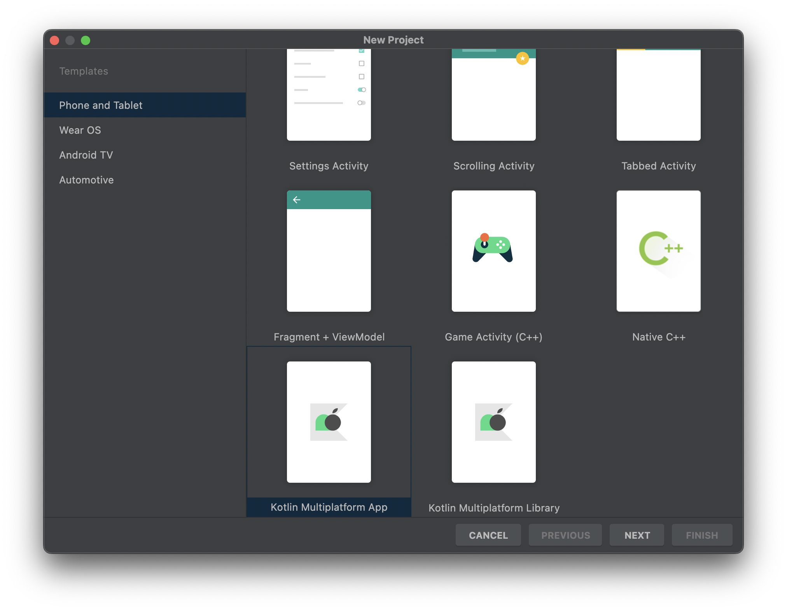
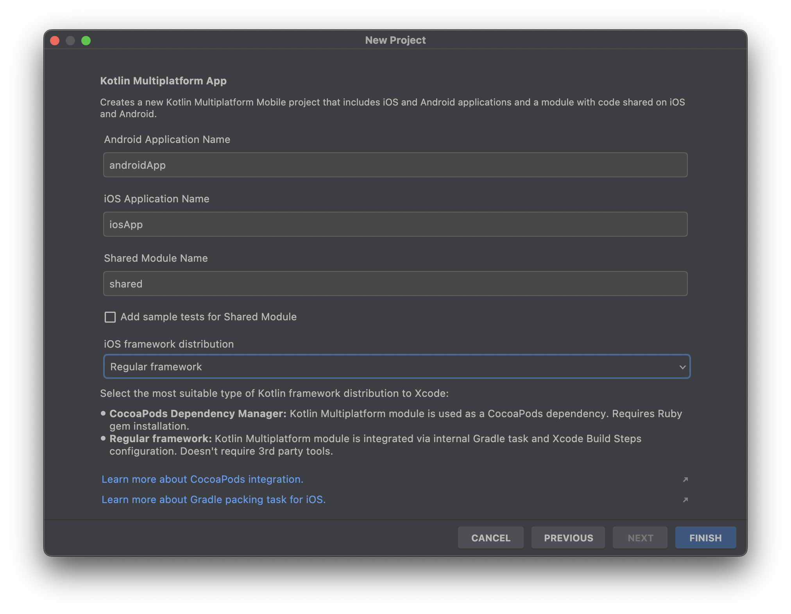

# KMM 시작하기

---

## KMM이란?

<aside>
💡 KMM은 Kotlin Mutliplatform Mobile로, Kotlin을 이용해 공통 모듈을 개발하고 이를 모바일 플랫폼에서 공유하여 개발할 수 있도록 지원해줍니다.

</aside>



- KMM은 다음과 같이 아래쪽 레이어가 공통 모듈(Shared Code)인 ***shared***이고, 그 위에 각 플랫폼 ***androidApp***, ***iosApp***이 있습니다. 공통 모듈 레이어는 순수 Kotlin 코드로만 작성되며 빌드 시 각 타겟 플랫폼에서 이용 가능한 아카이빙 형식으로 빌드됩니다. 공통 모듈은 다음과 같이 구성됩니다.
    - `commonMain` : 각 플랫폼이 순수하게 공유하는 로직이 담긴 부분으로 순수 Kotlin으로 작성됩니다.
    - `androidMain` : Android 플랫폼에 특화된 로직이 담기는 부분으로 Android 프레임워크에 접근할 수 있습니다.
    - `iosMain` : iOS 플랫폼에 특화된 로직이 담기는 부분으로 iOS 프레임워크에 접근할 수 있습니다.
- 공통 모듈인 `commonMain` 에는 각 플랫폼에 특화된 구현이 필요한 경우가 발생합니다. 이때,  KMM은 플랫폼에 의존적인 기능을 추상화하여 expect라는 키워드를 이용하여 공통 영역인 `commonMain`에 정의하고, 각 플랫폼 프레임워크에 접근하여 플랫폼 의존적인 기능을 구현할 수 있는 영역(`androidMain, iosMain`)에서 `actual`이라는 키워드를 통해 구현합니다. 이를 공통 영역에서는 각 플랫폼 구현체에 신경쓰지 않고 expect가 붙은 추상화된 인터페이스를 호출하여 공통 비즈니스 로직을 구현할 수 있게 됩니다.
    
    
    
    - 정의부에 expect 키워드를 사용하고, 구현부에 actual 키워드를 사용해야합니다.
    - expect 와 actual 정의부+구현부 쌍은 동일한 이름과 패키지명을 가져야 합니다.
    - expect 를 이용한 정의부는 구현부를 가질 수 없습니다.

---

## KMM 프로젝트 시작하기

<aside>
💡 KMM 프로젝트를 생성하고, 빌드 스크립트의 의존성을 추가해 개발 환경을 조성한다.

</aside>

### 프로젝트 생성

1. Android Studio에서 Plugin인 Kotlin Multi Platform을 설치한뒤, KMM Application 프로젝트를 새로 생성한다.
    
    
    
2. iOS framework distribution을 알맞게 설정해준다.
    
    
    

### BuildScript

---

<aside>
💡 BuildScript는 그래들에서 별도의 외부 라이브러리르 가져와야 할때 사용합니다. 해당 프로젝트에 필요한 스크립트 및 의존성을 추가해 개발 환경을 조성합니다.

</aside>

KMM의 build.gradle은 다음과 같이 구성되어 있습니다.

> 빌드 스크립트의 파일명은 Groovy DSL을 사용하는 경우는 `build.gradle`, Kotlin DSL을 사용하는 경우는 `build.gradle.kts`이다.
> 

```markdown
/build.gradle.kts
/shared/build.gradle.kts
/androidApp/build.gradle.kts
```

- `/build.gradle.kts` : 프로젝트 전반적으로 영향을 미치는 스크립트 파일 입니다. 프로젝트 전반적으로 영향을 미치는 플러그인이나 의존성을 가져오기 위한 저장소 위치 등을 설정 할 수 있습니다.
- `/shared/build.gradle.kts` : 공통 모듈의 빌드 스크립트 파일로 `commonMain`, `androidMain` , `iosMain`의 소스 및 의존성 설정 등을 할 수 있습니다.
- `/androidApp/build.gradle.kts` : /androidApp/build.gradle.kts 는 Andoird 애플리케이션 빌드를 위한 스크립트 파일로 shared 모듈에 대한 의존성을 포함, 앱 의존성들의 설정 및 앱과 관련된 여러가지 설정을 할 수 있습니다 (iOS App 은 XCode 프로젝트의 별도의 설정 파일을 사용합니다).
